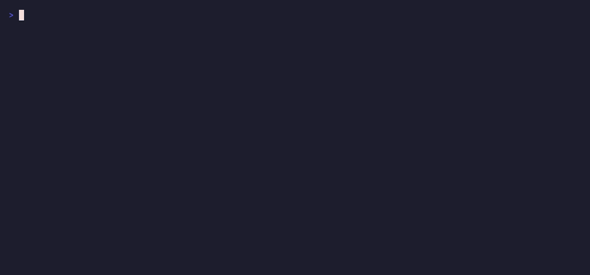

<p align="center">
  <picture>
    <source media="(prefers-color-scheme: dark)" srcset="noun-tree-dark.png">
    
  </picture>
</p>

# Waqwaq

A git-backed markdown wiki that humans browse and AI agents read and write, from one binary over one port.

## What it is

Waqwaq serves a folder of markdown two ways at once: a web UI for people to read, search, and edit, and a Model Context Protocol (MCP) endpoint on the same port for agents to read and write. Every page is a markdown file versioned with git, so changes have history, blame, and rollback. Agent writes pass a lint step first and commit with the author recorded.

The native layout is Andrej Karpathy's LLM wiki convention: pages under `wiki/`, raw documents under `raw/`, a `CLAUDE.md` schema at the root. Point it at a folder with no `wiki/` subdirectory and it serves the folder itself, so an existing notes folder or Obsidian vault works as-is.

## Demo

A terminal reader over your wiki; press `r` to walk a page's links.

<p align="center"></p>

Scriptable verbs (`toc`, `grep`, `cat --render`), and a `doctor` that checks the setup and the MCP/access posture.

<p align="center"></p>
<p align="center"></p>

Generate a wiki from a codebase: one page per package, linked by the real import graph.

<p align="center"></p>

## Quickstart

```bash
go install github.com/msradam/waqwaq@latest   # or: go build -o waqwaq .
waqwaq init mywiki                             # or point serve at an existing folder
waqwaq serve mywiki
```

The web UI is at `http://127.0.0.1:8000/`, the MCP endpoint at `/mcp`. Connect an agent with a `.mcp.json`:

```json
{ "mcpServers": { "mywiki": { "type": "http", "url": "http://127.0.0.1:8000/mcp" } } }
```

Or, with no running server, as a stdio subprocess:

```json
{ "mcpServers": { "mywiki": { "command": "waqwaq", "args": ["mcp", "/path/to/wiki"] } } }
```

Ask the agent to read the wiki and add a page: it writes markdown to disk, lint-checked and committed to git, and the page appears in the browser. Run with `--review` and agent writes become proposals you approve from `/proposals`; the merge records who proposed and who approved.

## OKF support

Waqwaq serves [Open Knowledge Format](https://github.com/GoogleCloudPlatform/knowledge-catalog/tree/main/okf) bundles natively. OKF bundles are directories of markdown files with a small set of standard YAML frontmatter fields: `type`, `description`, `resource`, `tags`, `timestamp`. Agents can query by type, follow `resource` links to the actual data assets, and reason about the knowledge graph.

Serving an OKF bundle with waqwaq gives you:

- `wiki_list` accepts a `type` parameter. `{ "type": "BigQuery Table" }` returns only matching pages, each with the full OKF metadata in the response.
- `wiki_graph` nodes include the OKF `type` field, so an agent can see what kind of thing each node is.
- The `/oracle` graph view colors nodes by type with a legend.
- Set `"okf": true` in config to require a `type` field on all pages, blocking writes that omit it.

Try the included example:

```bash
waqwaq serve examples/okf-demo
```

That's a small data catalog with datasets, BigQuery tables, and a metric, configured with `"okf": true`. Point any MCP client at it and ask "list all BigQuery Table docs" to see the type filter in action.

If you're using Google's OKF [enrichment agent](https://github.com/GoogleCloudPlatform/knowledge-catalog) to walk a BigQuery dataset and write OKF bundles to disk, point waqwaq at that same output directory.

## Surfaces

One folder, reached however you work. The read surfaces share one core, so their answers are identical.

- **Web UI** (`waqwaq serve`): browse, search, edit, image upload, plus the `/health` "Canopy" (orphans, broken and stale links) and the `/oracle` force-directed link graph with OKF type coloring.
- **MCP**: streamable HTTP at `/mcp`, or stdio via `waqwaq mcp <dir>`. The server name is the wiki's `title` from config; set `mcp_description` for a custom one-liner in the instructions.
- **CLI**: `waqwaq toc | grep | cat --render`, scriptable, with `--tag` / `--links-to` to scope search by the graph and `--json` for pipelines. Add `--remote URL` (or `WAQWAQ_REMOTE`) to query a running server.
- **TUI** (`waqwaq tui <dir>`): a terminal reader with filter, search, rendered pages, and `r` to walk the link graph.
- **JSON API**: `/api/pages`, `/api/search`, `/api/page/<slug>`, `/api/graph` (nodes include OKF type), and the graph queries, for non-MCP clients.
- **Static export** (`waqwaq export <dir> <out>`): a standalone HTML site for any static host, including GitHub Pages.
- **Codebase to wiki** (`waqwaq scan <go-repo> <out>`): one page per Go package, linked by the real import graph, no model required.

Diagnostics: `waqwaq doctor [dir]` checks setup and the MCP/access posture; `waqwaq check [dir]` lints pages and links for CI.

## MCP tools

- **Read**: `wiki_list` (with `prefix` and `type` filters; returns OKF metadata), `wiki_read`, `wiki_search`, `wiki_graph` (nodes include `type` and `degree`).
- **Navigate**: `wiki_hubs`, `wiki_neighbors`, `wiki_path`, `wiki_backlinks`, `wiki_tags`.
- **Maintain**: `wiki_health`, `wiki_recent`, `wiki_history`.
- **Raw documents**: `wiki_list_raw`, `wiki_read_raw`, `wiki_ingest`, `wiki_delete_raw`.
- **Write and review**: `wiki_lint`, `wiki_write`, `wiki_delete`, `wiki_list_proposals`.

Read tools are always available; write tools require non-read-only mode. `wiki_write` and `wiki_delete` follow the same access model: a trusted caller commits to git directly, anyone else (or `--review`) queues a proposal recoverable from git history.

## Existing knowledge bases

The native format is clean markdown with YAML frontmatter and `[[wikilinks]]`. Waqwaq also reads existing knowledge bases with tolerant link resolution: bare `[[wikilinks]]` resolve by basename anywhere in the tree, case and space and hyphen are folded, and a piped `[[a|b]]` resolves from either side. Frontmatter is read as YAML, TOML, or JSON.

Obsidian vaults, Quartz and Foam gardens, GitHub project wikis, Dendron vaults, and Hugo or Zola sites serve and navigate. It does not write back in another tool's conventions, nor interpret format-specific models like Logseq block references or Dendron's filename hierarchy.

## Configuration

`waqwaq serve [dir]` flags: `--addr` (default `127.0.0.1:8000`), `--read-only`, `--review`, `--tokens FILE`. Each has a `WAQWAQ_*` environment equivalent.

Optional settings live in `<dir>/.waqwaq/config.json`, all fields optional:

```json
{
  "title": "Acme Data Catalog",
  "mcp_description": "Acme's internal data catalog: datasets, tables, and metrics",
  "accent": "madder",
  "theme": "manuscript",
  "okf": true,
  "webhook": "https://hooks.slack.com/services/XXX",
  "web": {
    "proxy_header": "X-Forwarded-User",
    "default_role": "viewer",
    "admins": ["adam"],
    "editors": ["dev"]
  },
  "lint": {
    "require_frontmatter": ["owner"],
    "banned_terms": [{ "term": "TODO", "severity": "warning" }]
  }
}
```

Config fields:

- `title`: the wiki's display name and the MCP server identity. An MCP client sees this as the server name, not "waqwaq."
- `mcp_description`: the one-liner shown to agents in MCP instructions. Omit to use a generic default.
- `okf`: when `true`, requires a `type` frontmatter field on every page and enables type filtering in `wiki_list`, typed nodes in `wiki_graph`, and type-colored Oracle graph.
- `theme` / `accent`: the [Lokta](https://github.com/msradam/lokta) design system. `theme`: `auto` (default), or a stock name (`paper`, `manuscript`, `bone`, `ink`, `indigo`, `highland`, `pine`, `mulberry`, `slate`, `steel`, `onyx`, and `-light` variants). `accent`: a pigment name (`marigold`, `peach`, `lavender`, `madder`, `walnut`, `turmeric`, `lac`, `aubergine`, `cinnabar`, `celadon`, `indigo`, `-light` variants) or any CSS color.
- `webhook`: Slack-compatible POST when a write is queued for review.
- `lint.require_frontmatter`: frontmatter fields that must be non-empty on every page.
- `lint.banned_terms`: terms blocked from page bodies (`"severity": "error"` or `"warning"`).

A `<dir>/.waqwaq/custom.css` overrides the built-in styles. Markdown files in `<dir>/.waqwaq/templates/` become new-page starting points.

### Access control

By default writes commit straight to git and the web UI trusts loopback access. To gate the MCP endpoint, create `<dir>/.waqwaq/tokens.json`:

```json
{ "tokens": [
  { "token": "ci-secret",   "name": "ci-bot", "trusted": false },
  { "token": "adam-secret", "name": "adam",   "trusted": true }
] }
```

The MCP endpoint then requires `Authorization: Bearer <token>` (401 otherwise). A `trusted` token commits directly; any other token's writes become proposals. The token's `name` becomes the git author. `--review` queues every write regardless.

For the web UI, set `web.proxy_header` to delegate auth to a reverse proxy (oauth2-proxy, Authelia), or set `web.users` (each `{ "name", "password", "role" }`, password a bcrypt hash from `waqwaq passwd`) for built-in login. Roles: `viewer` reads, `editor` edits and uploads, `admin` also approves proposals. Run `waqwaq doctor` to check the posture before serving.

Pass multiple directories to `serve` to host several wikis under `/w/<name>/`, each with its own git repo, tokens, and config.

## Platforms

Pure Go, no cgo, cross-compiles to any `GOOS`/`GOARCH`. Full-text search uses the pure-Go `modernc.org/sqlite` driver; build with `-tags nofts` to drop the FTS index and fall back to substring search (selected automatically when `GOOS=zos`).

## Development

```bash
go test ./...
go build -o waqwaq .
```

Developed with AI assistance.

## License

MIT. See [LICENSE](LICENSE).

The tree icon is by JK KIM from the [Noun Project](https://thenounproject.com).
