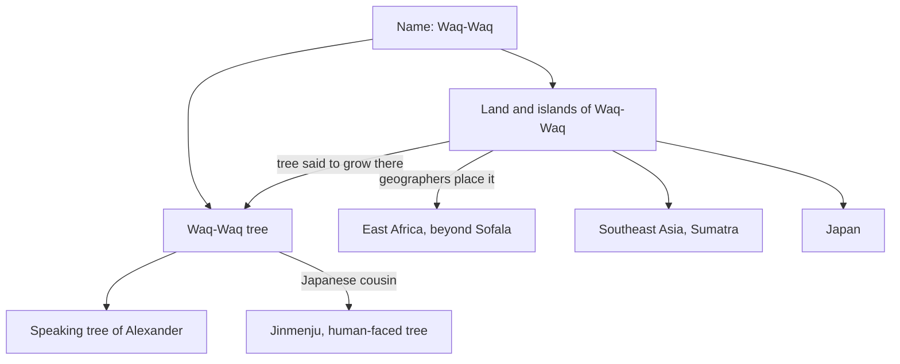

# Waq-Waq

Waq-Waq (Arabic *al-Wāqwāq*) is a name that medieval Arabic and Persian writers attached to two linked wonders: a distant land or cluster of islands at the edge of the known world, and a marvellous tree whose fruit grew in the shape of human heads or whole women and cried out the word *waq waq*. The two ideas were often joined, the tree being said to grow in the country that shared its name.

The name occurs in more than twenty Arabic sources written between the ninth and fourteenth centuries. Some treat Waq-Waq as a real place reached by traders, others as a country of marvels at the world's rim. Geographers disagreed about where it lay and about what could be found there, while later Persian poetry and painting fixed the talking tree as one of the lasting images of the tradition.

## The main strands

- [[waqwaq-tree|The Waq-Waq tree]], the tree of talking fruit.
- [[islands-of-waqwaq|The islands of Waq-Waq]], and the long argument over where they were.
- [[speaking-tree|The speaking tree]] that foretold the death of Alexander.
- [[ajaib-al-makhluqat|The wonders-of-creation literature]] that preserved the story.
- [[jinmenju|The jinmenju]], the laughing human-faced tree of Japan.
- [[etymology|The name]] and what it might mean.
- [[in-art|The tree in painting]].

## How the parts relate

For the works behind these accounts, see [[sources|Sources and further reading]].
