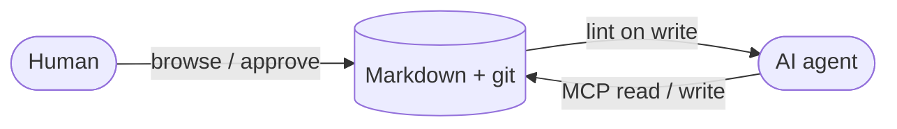

# Welcome to Waqwaq

A git-backed markdown wiki that **humans browse** and **AI agents read and write**, served from one binary over one port.

- Browse pages from the sidebar.
- Point an MCP client at `/mcp` to let an agent read and update these pages.
- Every write runs through lint and lands as a git commit, so nothing rots silently.

See [[concepts/mcp]] for how an agent connects.
